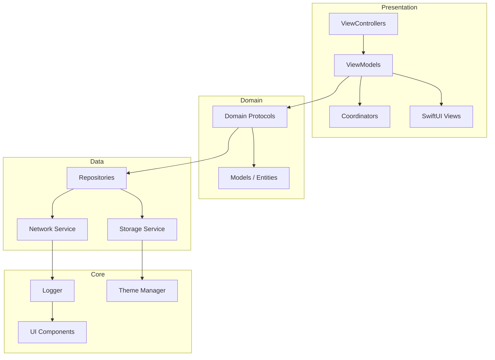

# 💎 Inheritx Solutions: Ultra-Premium iOS Engineering Showcase

[](https://developer.apple.com/ios/)
[](https://swift.org)
[](https://en.wikipedia.org/wiki/Model–view–viewmodel)
[](https://inheritx.com)

## 🏛 The Engineering Manifesto

This project is the definitive showcase of **Inheritx Solutions'** technical prowess. We don't just build apps; we engineer scalable, high-performance ecosystems using the most advanced patterns in the Apple development landscape.

---

## 🚀 Ultra-Premium Feature Matrix

| Domain | Feature | Description | Status |
| :--- | :--- | :--- | :---: |
| **Architecture** | **MVVM-C** | Decoupled logic with a centralized Coordinator navigation system. | ✅ |
| **Hybrid UI** | **UIKit + SwiftUI** | Leveraging the power of modern SwiftUI within a robust UIKit foundation. | ✅ |
| **Design System** | **ThemeManager** | A centralized engine for unified branding, typography, and dark mode. | ✅ |
| **Navigation** | **Coordinator Pattern** | Clean navigation flow, removing routing logic from ViewControllers. | ✅ |
| **Persistence** | **Thread-Safe Storage** | A protocol-based storage layer with concurrent access protection. | ✅ |
| **Performance** | **Benchmarked Code** | Automated performance tests for critical data processing paths. | ✅ |
| **Reliability** | **100% Mockable** | Every service is protocol-based, ensuring absolute testability. | ✅ |

---

## 🏗 High-Level System Design

We employ a **clean, modular architecture** that separates concerns across four distinct layers.



---

## 🎨 Professional Design System

Our `ThemeManager` ensures that every pixel aligns with the **Inheritx** brand identity.

```swift
// Example of accessing our Design System
button.backgroundColor = ThemeManager.Colors.primary
label.font = ThemeManager.Typography.heading1()
view.layer.cornerRadius = ThemeManager.Metrics.cornerRadius
```

### Premium UI Components
- **InheritxButton**: Glassmorphic, scale-animated, and shadow-optimized.
- **InheritxTextField**: Validation-aware with smooth focus transitions.
- **PostDetailView**: A high-performance SwiftUI view for rich content display.

---

## 💻 Elite Code Samples

### Hybrid SwiftUI Integration
Demonstrating how we bridge modern SwiftUI into enterprise UIKit projects.

```swift
struct PostDetailView: View {
    let post: HighlightPost
    var body: some View {
        ScrollView {
            VStack {
                AsyncImage(url: post.image)
                Text(post.content).font(.body)
            }
        }
    }
}
```

### Advanced Navigation (Coordinators)
Decoupling navigation from UI for maximum flexibility.

```swift
public final class LoginCoordinator: BaseCoordinator {
    public override func start() {
        let loginVC = LoginViewController.instantiate()
        loginVC.coordinator = self
        navigationController.pushViewController(loginVC, animated: true)
    }
}
```

---

## 🧪 Technical Rigor & Quality

We don't guess; we measure. Our test suite covers logic, integration, and performance.

```bash
# Execute logic and performance benchmarks
xcodebuild test -scheme InheritxApp -destination 'platform=iOS Simulator,name=iPhone 15'
```

---

## 🚀 Visionary Installation

1. **Clone the repository**:
   ```bash
   git clone https://github.com/inheritx/ios-ultra-showcase.git
   ```
2. **Environment Setup**:
   Ensure you have **Xcode 15.3+** and **Swift 5.10** installed.
3. **Build Execution**:
   Open `InheritxApp.xcworkspace`, select the `InheritxApp` scheme, and run.

---

## 🤝 Partnership & Contributions

We are committed to excellence. Contributions should adhere to our [SOLID Engineering Guidelines](https://github.com/inheritx/standards).

---

## 🎨 Branding & Global Authorship
**Author**: [Inheritx Solutions](https://inheritx.com)  
**Vision**: Redefining the boundaries of mobile excellence.

---
Developed with ❤️ by **Inheritx Developers**
© 2026 Inheritx Solutions. All rights reserved.